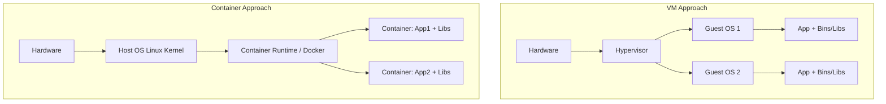

# Module 1: The Compute Evolution (Where Code Runs)

As a senior backend engineer, you're accustomed to packaging your Spring Boot application into a `.jar` file and running `java -jar app.jar`. Locally, the operating system kernel handles thread allocation, memory management via the JVM, and network port binding. But in a massive production environment serving millions of requests, where exactly does that code run?

This module bridges the gap between local execution and cloud infrastructure, explaining not just *how* we deploy, but *why* the industry evolved its deployment paradigms.

---

## 1. Bare Metal to Hypervisors to EC2

Historically, deploying software meant buying physical servers ("bare metal"), racking them in a data center, installing Linux, and installing Java. The problem? **Underutilization and rigidity.** If your app used 10% of the server's CPU, the other 90% was wasted. If traffic spiked, buying and installing a new server took weeks.

### The Hypervisor Revolution
To solve underutilization, the industry adopted **Hardware Virtualization**. A Hypervisor (like VMware ESXi or KVM) is a specialized OS installed directly on bare metal. It allows multiple "Guest OSs" (Virtual Machines) to run concurrently on a single physical machine, isolating CPU and memory.

### AWS EC2: The Cloud Virtual Machine
Amazon Elastic Compute Cloud (EC2) took hypervisors and put an API in front of them. When you provision an EC2 instance, you are not renting a physical server; you are renting a Virtual Machine running on a massive rack of AWS-owned hardware (powered by AWS's custom "Nitro" hypervisor).

```mermaid
graph TD
    subgraph Physical Server [AWS Physical Host (Bare Metal)]
        H[Nitro Hypervisor]

        subgraph EC2 Instance A [Your EC2 Instance]
            OS1[Guest OS: Ubuntu]
            JVM1[JVM]
            App1[Spring Boot App]
        end

        subgraph EC2 Instance B [Another AWS Customer's Instance]
            OS2[Guest OS: Amazon Linux]
        end

        H --> EC2 Instance A
        H --> EC2 Instance B
    end
```

#### Key EC2 Components for the Backend Engineer:
* **The Compute (Instance Type):** E.g., `t3.large` (2 vCPUs, 8GB RAM). A "vCPU" is essentially a hyperthread on the underlying physical CPU.
* **The Disk (EBS Volume):** Elastic Block Store (EBS) is a virtual hard drive attached to your EC2 instance over the network. If your EC2 instance hardware fails, your EBS volume can be detached and attached to a new instance. It's persistent storage, separate from compute.
* **The Firewall (Security Groups):** An instance-level firewall. For a backend API, your Security Group typically only allows inbound traffic on port `8080` (or `443`) and strictly from a specific source (like an internal Load Balancer).

**Why it matters:** In traditional VM deployments, you still have to manage the OS. You must SSH in, run `apt-get update`, install Java 17, set up systemd services to run your `.jar`, and manage log rotation. This operational overhead is immense at scale.

---

## 2. PaaS: Abstraction via Elastic Beanstalk

Engineers realized that manually configuring VMs is anti-pattern for rapid software delivery. We just want to run code. This led to **Platform as a Service (PaaS)**.

AWS Elastic Beanstalk is a classic PaaS. It abstracts away the raw EC2 provisioning. You simply upload your `.jar` file, and Beanstalk handles the orchestration.

```mermaid
flowchart LR
    Dev[Developer] -->|Uploads .jar| EB[Elastic Beanstalk Control Plane]

    subgraph AWS Infrastructure Managed by Beanstalk
        ALB[Application Load Balancer]

        subgraph Auto Scaling Group
            EC2_1[EC2 Instance - JVM]
            EC2_2[EC2 Instance - JVM]
        end

        ALB -->|Routes Traffic| EC2_1
        ALB -->|Routes Traffic| EC2_2
    end

    EB -.->|Provisions & Configures| ALB
    EB -.->|Provisions & Configures| Auto Scaling Group
```

### The Magic of the Auto Scaling Group (ASG)
Under the hood, Beanstalk creates an **Auto Scaling Group**. An ASG has a "Launch Template" (instructions on how to boot an EC2 instance and download your `.jar` file from S3).

If CPU utilization hits 80%, CloudWatch alarms trigger the ASG to spin up a new EC2 instance, install Java, pull your `.jar`, start it, and register it with the Load Balancer.

**The Pitfall of PaaS:** While great for simple apps, PaaS platforms often become "black boxes." When you need custom OS-level libraries (like specific C++ bindings for a video processing library) or complex sidecar processes (like a custom metrics agent), wrestling with Beanstalk configuration files (`.ebextensions`) becomes a nightmare.

---

## 3. The Container Paradigm Shift

The industry needed the simplicity of PaaS but the control of raw EC2. This birthed the container revolution.

### The "It Works on My Machine" Problem
If your Java app works locally but crashes on EC2, it's usually an environmental mismatch. Maybe EC2 has Java 11 instead of 17. Maybe an OS-level environment variable is missing.

### Enter Docker
A Docker container doesn't just package your `.jar`; it packages the **entire user-space operating system**, the JDK, the environment variables, and the `.jar` into a single, immutable artifact called an **Image**.

```dockerfile
# A standard Dockerfile for a Spring Boot App
FROM eclipse-temurin:17-jre-alpine
WORKDIR /app
COPY target/my-backend.jar app.jar
EXPOSE 8080
ENTRYPOINT ["java", "-jar", "app.jar"]
```

#### Containers vs. Virtual Machines
This is the crucial distinction: **Containers are not VMs.**
* A VM virtualizes the *hardware* (running a full, heavy OS kernel).
* A Container virtualizes the *Operating System*.

Multiple containers running on the same EC2 instance share the same underlying Linux Kernel. Docker uses Linux features like **Namespaces** (for isolation, so Container A can't see Container B's processes) and **Cgroups** (for resource limiting, so Container A can only use 500MB of RAM).



### Why We Moved from EC2/Beanstalk to Containers:
1. **Immutability:** The exact same image artifact tested in staging is deployed to production. Zero environmental drift.
2. **Speed:** Booting a VM takes minutes (OS boot sequence). Starting a container takes milliseconds (it's just starting a standard Linux process).
3. **Density:** Because containers lack the overhead of a guest OS, you can pack hundreds of microservice containers onto a single heavy EC2 instance, saving massive compute costs.

**What typically breaks:**
* **OOMKills (Out of Memory):** The JVM historically struggled to understand container Cgroup memory limits, thinking it had access to the full host RAM, leading to over-allocation and the Linux kernel brutally killing the container. (Modern Java 11+ is container-aware).
* **Ephemeral Storage:** Containers are stateless. If your app writes logs or files locally to the container filesystem, they are permanently lost the moment the container restarts. You must stream logs to `stdout` and write files to external storage (like S3).

> **Next up:** Now that we know *what* our code runs in, we need to understand *where* it sits on the network. In Module 2, we tackle the hardest part for backend engineers: VPCs, Subnets, and Network Security.