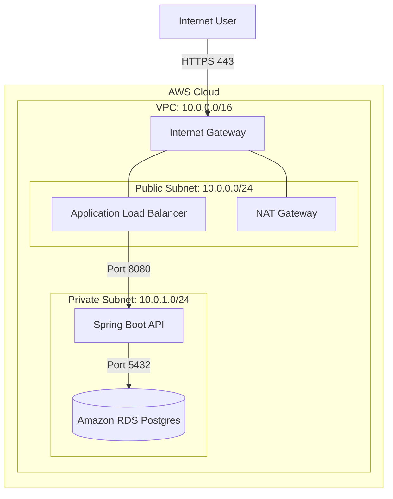
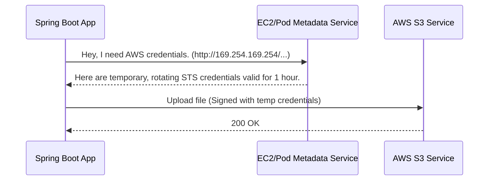

# Module 2: The Network & Security Spine (The Hardest Part)

Backend engineers often struggle here because networking is largely abstracted away in local development. When running `localhost`, your app talks directly to a local Postgres instance without thinking about firewalls, routing tables, or gateways.

In a production cloud environment, deploying a microservice with a public IP address is a massive security violation. We must control exactly who can talk to our applications and where our applications can send traffic.

---

## 1. VPC (Virtual Private Cloud) Architecture

A **VPC** is your logically isolated slice of the AWS cloud. Think of it as your own private data center in the sky. You define its IP address range (e.g., `10.0.0.0/16`, giving you 65,536 private IPs).

### The Subnet Divide: Public vs. Private

Inside your VPC, you divide your IP space into **Subnets**. The fundamental rule of cloud architecture is segmenting resources based on their need to access the public internet.

*   **Public Subnets:** Resources here are assigned a public IP address and have a direct route to the Internet.
    *   *What lives here?* **Only Load Balancers (ALB) and Gateways.**
*   **Private Subnets:** Resources here only have private IP addresses (e.g., `10.0.1.50`). They cannot be reached directly from the internet.
    *   *What lives here?* **Everything else.** Your Spring Boot apps, your Kubernetes nodes, your Databases, your Caches.

**The Flow of Incoming Traffic:**
1. A user requests `api.yourcompany.com`.
2. DNS resolves to the Application Load Balancer in the **Public Subnet**.
3. The ALB terminates the SSL/TLS connection.
4. The ALB forwards the raw HTTP request over the private network to your Spring Boot app in the **Private Subnet**.
5. Your app talks to the database, processes the request, and returns the response through the ALB.

---

## 2. Gateways & Routing: The NAT Problem

If your Spring Boot app is in a Private Subnet (no public IP), how does it pull dependencies from Maven Central, download a new Docker image, or call an external API (like Stripe)?

If it has no internet access, it's completely isolated.

### The Solution: NAT Gateway (Network Address Translation)
A NAT Gateway lives in the **Public Subnet**. You configure the "Route Table" of your Private Subnet to say: *"If the app tries to send traffic to the internet (0.0.0.0/0), send it to the NAT Gateway instead."*

1. Your app tries to call `stripe.com`.
2. Traffic hits the NAT Gateway.
3. The NAT Gateway swaps your app's private IP with its own Public IP and forwards the request out via the Internet Gateway.
4. When Stripe responds, the NAT Gateway remembers who asked, swaps the IPs back, and routes the response to your app.

**Why it matters:** This allows private microservices to reach *out* to the internet without allowing the internet to reach *in*.

**What typically breaks:** NAT Gateways are expensive and charge by the gigabyte processed. A common production mistake is having a massive data-processing app in a private subnet download terabytes of data from an S3 bucket via the NAT Gateway, resulting in astronomical AWS bills. *(The fix: Use VPC Endpoints to route S3 traffic internally).*

---

## 3. IAM: Identity and Access Management

Traditional applications handle security via hardcoded credentials. You might have an `application.properties` file with an `AWS_ACCESS_KEY_ID` to upload files to an S3 bucket.

**This is a massive security risk.** If a developer accidentally commits that file to GitHub, your AWS account is compromised within seconds by automated bots.

### The Modern Paradigm: IAM Roles

In a production environment, your code should **never** contain AWS credentials. Instead, we use **IAM Roles**.

An IAM Role is an identity with specific, granular permissions (e.g., "Allow putting objects into `my-app-bucket`"). You attach this Role directly to the compute resource (the EC2 instance, or the Kubernetes Pod) that runs your code.

#### How it works seamlessly in Java:
When you use the AWS Java SDK (`S3Client.builder().build()`) without specifying credentials, it automatically executes a "Default Credential Provider Chain."
1. It checks environment variables.
2. It checks Java system properties.
3. **Crucially:** It checks the Instance Metadata Service (IMDS).

Because the IAM Role is attached to the instance, the AWS SDK transparently queries a local metadata endpoint (running on the host OS), receives temporary, automatically rotating credentials, and signs your API requests.

**The Pitfall of IAM:** "Over-permissioning." It is incredibly common for developers to get frustrated with "Access Denied" errors and attach the `AdministratorAccess` policy to their application's role. If your application has a remote code execution (RCE) vulnerability, the attacker now has root access to your entire cloud infrastructure. Always practice the **Principle of Least Privilege**.

> **Next up:** We understand the VMs, and we understand the network they sit in. But managing hundreds of VMs and routing rules manually is impossible. In Module 3, we introduce the orchestrator: Kubernetes.