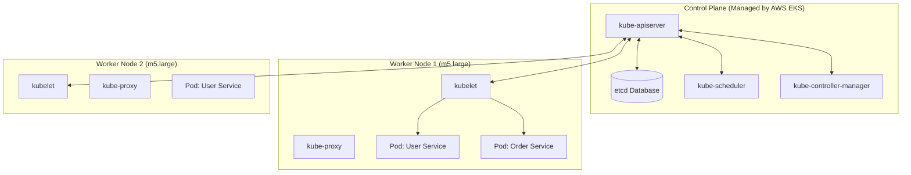
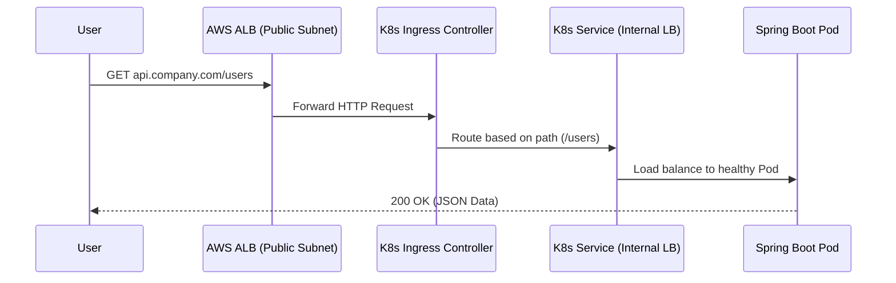

# Module 3: Kubernetes (K8s) in Production

If Docker solved the "It works on my machine" problem, Kubernetes (K8s) solved the "How do I run 5,000 of these containers across 50 servers without losing my mind?" problem.

K8s is not just a container runner; it is a **desired state orchestrator**. You don't tell Kubernetes *how* to do things; you tell it *what* you want the world to look like (e.g., "I want 5 copies of the User Service running at all times"), and K8s constantly works to make reality match your desired state.

---

## 1. The Architecture: Control Plane vs. Worker Nodes

A Kubernetes cluster is fundamentally divided into two parts: the brains (Control Plane) and the brawn (Worker Nodes).

### The Control Plane
This is the central management entity. It makes global decisions about the cluster, detects and responds to cluster events.
*   **kube-apiserver:** The front door. When you run `kubectl apply`, you are talking to this REST API. It is the only component that talks directly to the database.
*   **etcd:** The cluster database. A highly available, distributed key-value store containing the state of the entire cluster.
*   **kube-scheduler:** The dispatcher. It watches for newly created containers and assigns them to an appropriate Worker Node based on resource requirements (CPU/RAM).
*   **kube-controller-manager:** The reconciler. It continuously runs control loops to ensure the current state matches the desired state (e.g., if a node dies, it notices the missing containers and asks the API to create new ones).

### The Worker Nodes
These are the actual EC2 instances where your Spring Boot containers run.
*   **kubelet:** The captain of the node. It receives instructions from the API Server and ensures the containers are running and healthy.
*   **kube-proxy:** Manages network rules on the node, allowing communication to your containers.
*   **Container Runtime:** (Like `containerd` or Docker) The software that actually pulls the image and runs it.



### Why AWS EKS?
Running a highly available `etcd` cluster and securing the API server is incredibly difficult. **Amazon Elastic Kubernetes Service (EKS)** completely hides the Control Plane from you. AWS manages the API server and `etcd` nodes across multiple availability zones. You only pay for and manage the Worker Nodes (the EC2 instances).

---

## 2. The Container Lifecycle: Deployments and Pods

In K8s, you rarely deploy a container directly. You deploy a **Pod**.

### What is a Pod?
A Pod is the smallest deployable unit in Kubernetes. It usually contains one container (your Spring Boot app), but it can contain multiple tightly coupled containers (like an app container and a logging "sidecar" container) that share the same IP address and local storage.

### The Deployment Abstraction
To deploy your app to production, you write a YAML file defining a **Deployment**.

```yaml
apiVersion: apps/v1
kind: Deployment
metadata:
  name: user-service-deployment
spec:
  replicas: 3
  selector:
    matchLabels:
      app: user-service
  template: # This is the Pod blueprint
    metadata:
      labels:
        app: user-service
    spec:
      containers:
      - name: spring-boot-app
        image: my-repo/user-service:v1.2
        ports:
        - containerPort: 8080
```

1. You submit this to the API Server.
2. The Deployment controller creates a **ReplicaSet** whose job is to ensure exactly `3` Pods labeled `app: user-service` exist.
3. The Scheduler assigns these 3 Pods to available Worker Nodes.
4. **The Magic:** If a Worker Node explodes, the 1 Pod on that node dies. The ReplicaSet immediately sees only 2 Pods exist, creates a new Pod, and the Scheduler places it on a healthy Node. **Self-healing infrastructure.**

---

## 3. Networking: How Traffic Reaches Your Code

Because Pods are constantly dying and spinning up on different nodes with different internal IP addresses, you cannot hardcode a Pod IP to send traffic.

### The Internal Network: Services
A **Service** provides a stable, internal IP address and DNS name (e.g., `user-service.default.svc.cluster.local`) that load-balances traffic across all healthy Pods that match a label. Your internal Order Service will use this DNS name to talk to the User Service, oblivious to which physical Node those Pods are on.

### The External Network: Ingress
How does an internet user hit your Pod?

1. **User requests** `api.yourcompany.com`.
2. Traffic hits the **AWS Application Load Balancer (ALB)** (configured in a Public Subnet).
3. The ALB forwards traffic to the Worker Nodes.
4. An **Ingress Controller** (a specialized Pod running inside K8s, like NGINX or AWS Load Balancer Controller) receives the traffic, reads the HTTP Host header, and looks at K8s Ingress rules.
5. The Ingress rule says: "Traffic for `/users` goes to the `user-service` Service."
6. The Service forwards it to your Spring Boot Pod.



**What typically breaks:**
* **Liveness/Readiness Probes:** K8s doesn't magically know if your app is healthy. It only knows if the Java process is running. If your app deadlocks, the process is up, but it's broken. You must configure *Readiness Probes* (e.g., hitting `/actuator/health`). If a probe fails, K8s stops sending traffic to that Pod.
* **Resource Limits:** If you don't define CPU/Memory limits in your Pod YAML, a single runaway Spring Boot application can consume 100% of a Worker Node's RAM, starving other microservices and causing cascading node failures.

> **Next up:** We have our K8s cluster ready, but manually typing `kubectl apply` every time we want to release a new feature is dangerous. In Module 4, we automate the path to production with CI/CD Pipelines.