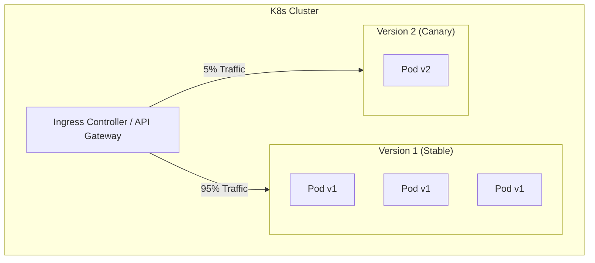

# Module 4: CI/CD & The Deployment Pipeline

At scale, human intervention during a deployment is a bug. Hand-typing deployment commands introduces human error, breaks auditability, and slows down release cycles.

To safely move code from a developer's Git commit to a running Pod in a production Kubernetes cluster, we rely on **Continuous Integration and Continuous Deployment (CI/CD)** pipelines.

---

## 1. The Anatomy of a Pipeline

Whether you use Jenkins, GitLab CI, or GitHub Actions, a modern pipeline follows a deterministic flow. If any stage fails, the pipeline halts, preventing broken code from reaching production.

### Stage Breakdown for Java/Spring Boot:
1.  **Checkout & Compile:** Pull the code and run `mvn clean compile`. This catches basic syntax errors immediately.
2.  **Testing:** Run `mvn test`. This executes unit and integration tests. In a robust setup, this stage might spin up lightweight databases via *Testcontainers* to test real DB queries before tearing them down.
3.  **Security Scans:**
    *   *SAST (Static Application Security Testing):* Tools like SonarQube scan the raw code for vulnerabilities (e.g., SQL injection risks).
    *   *SCA (Software Composition Analysis):* Tools scan your `pom.xml` or `build.gradle` for dependencies with known CVEs (like the infamous Log4j vulnerability).
4.  **Build & Containerize:** Execute `docker build`. The compiled `.jar` is packaged into a Linux environment.
5.  **Push to Registry:** The built image is pushed to a secure remote storage location, like **AWS Elastic Container Registry (ECR)**. The image is usually tagged with the Git commit hash (e.g., `my-app:a1b2c3d`) for perfect traceability.
6.  **Deploy:** The pipeline authenticates to the EKS cluster and updates the Kubernetes Deployment to point to the new image tag.

---

## 2. Deployment Strategies: Safely Shifting Traffic

Once the pipeline tells Kubernetes to deploy the new image, *how* does Kubernetes actually replace the old code with the new code? Doing it all at once causes downtime.

### Strategy A: Rolling Updates (The Kubernetes Default)
Kubernetes spins up one new Pod with v2. Once that Pod passes its Readiness Probe (proving it can handle traffic), K8s shuts down one old Pod with v1. It repeats this process sequentially until all Pods are running v2.

*   **Pros:** Zero downtime. Simple to configure.
*   **Cons:** Rollbacks are slow (you have to execute a reverse rolling update). During the update, both v1 and v2 are running simultaneously, meaning your database must be compatible with both codebases.

### Strategy B: Blue/Green Deployments
You maintain two completely identical production environments (Blue and Green). If Blue is currently live (v1), the pipeline deploys v2 entirely to Green. Green is tested internally. Once verified, the Load Balancer router is instantly switched from Blue to Green.

*   **Pros:** Instant cutover. Instant rollback (just flip the router back to Blue).
*   **Cons:** Expensive. You are paying for double the infrastructure. Data synchronization between Blue and Green databases during the cutover can be incredibly complex.

### Strategy C: Canary Releases (The Gold Standard for Scale)
You deploy v2 to a small subset of infrastructure (e.g., 1 Pod out of 20). You configure your Load Balancer (or an advanced service mesh like Istio) to route exactly 5% of real user traffic to the v2 "Canary" Pod.

You monitor the Canary's error rates and latency. If metrics look good, you gradually increase traffic to 20%, 50%, and finally 100%.

*   **Pros:** Safest way to deploy. You test with real user traffic but limit the blast radius of a bug to only 5% of users.
*   **Cons:** Requires advanced networking (Service Mesh) and highly mature observability tooling (Prometheus/Datadog) to automate the analysis of the Canary metrics.

---

## 3. GitOps: The Evolution of CI/CD

Traditionally, pipelines (like Jenkins) run a command like `kubectl apply` directly against the cluster. This is called a "Push" model.

The modern industry standard is **GitOps** (using tools like ArgoCD or Flux), which uses a "Pull" model.

Instead of the pipeline touching the cluster, the pipeline simply updates a separate Git repository that holds your Kubernetes YAML files. An agent running *inside* your K8s cluster continuously monitors that Git repository. When it sees a change (e.g., the image tag was updated to `v2`), it pulls the new YAML down and applies it internally.

**Why it matters:**
1.  **Security:** Your CI/CD server no longer needs admin credentials to your production cluster.
2.  **Drift Reconciliation:** If a junior developer manually changes a setting via `kubectl`, ArgoCD instantly detects that the cluster state has "drifted" from the Git state, and forcefully overwrites the manual change, restoring the system to the truth stored in Git.

> **Next up:** In Module 5, we will connect all these concepts together, exploring common architectural pitfalls, performance considerations at scale, and further reading for the senior engineer.